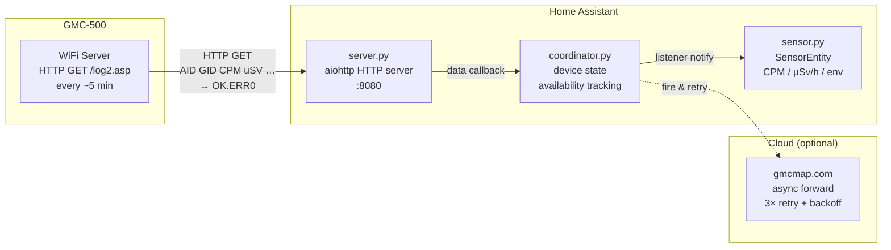

# GQ GMC-500 → Home Assistant

[](https://github.com/hacs/integration) [](https://github.com/volschin/gq_gmc-500/releases) [](LICENSE) [](https://www.home-assistant.io/docs/quality_scale/)

[](https://github.com/volschin/gq_gmc-500/actions/workflows/test.yml) [](https://github.com/volschin/gq_gmc-500/actions/workflows/hacs.yml) [](https://github.com/volschin/gq_gmc-500/actions/workflows/hassfest.yml)

Direct integration of the [GQ Electronics GMC-500](https://www.gqelectronicsllc.com/) Geiger counter into Home Assistant via **local push over WiFi** — no cloud, no polling, no extra hardware.

## ✨ Features

- ☢️ **Radiation + environment sensors** — CPM, dose rate (µSv/h), temperature, humidity, pressure
- 🔍 **Automatic device discovery** — new devices are detected on first data; confirm or ignore in HA
- 📡 **Multi-device support** — one integration handles multiple GMC-500 units via AID/GID pairs
- 🌐 **gmcmap.com forwarding** — asynchronous upload with 3× retry and backoff; never blocks HA
- 🏠 **100% local** — no cloud dependency, works completely on your LAN

## 📦 Installation

### HACS (recommended)

[](https://my.home-assistant.io/redirect/hacs_repository/?owner=volschin&repository=gq_gmc-500&category=integration)

1. Open HACS in Home Assistant
2. **Integrations** → three dots top right → **Custom repositories**
3. Add URL: `https://github.com/volschin/gq_gmc-500`, category: **Integration**
4. Search for **GQ GMC-500** and click **Download**
5. Restart Home Assistant

### Manual Installation

1. Download the latest release from the [Releases page](https://github.com/volschin/gq_gmc-500/releases)
2. Copy the `gmc500` folder to `config/custom_components/gmc500/`
3. Restart Home Assistant

## ⚙️ Setup

### 1 — Configure the device

On the GMC-500, go to **Menu → WiFi → WiFi Server**:
- **Server**: your HA instance IP (e.g. `192.168.1.10`)
- **Port**: the port you'll configure in HA (default `8080`)
- Enable the WiFi server

### 2 — Add the integration

1. **Settings → Devices & Services → Add Integration** → search **GQ GMC-500**
2. Enter the HTTP port to listen on (default `8080`, range 1024–65535)
3. When the device sends its first reading, a HA notification appears — confirm or ignore the device
4. Sensors appear automatically after confirmation

### Options (reconfigurable)

Change the listening port at any time: **Settings → Devices & Services → GQ GMC-500 → Configure**

## 📊 Sensors

| Entity | Unit | Notes |
|--------|------|-------|
| CPM | CPM | Counts per minute (live) |
| Average CPM | CPM | Running average — diagnostic, disabled by default |
| Dose Rate | µSv/h | Equivalent dose rate |
| Temperature | °C | Only if device reports it |
| Humidity | % | Only if device reports it |
| Atmospheric Pressure | hPa | Only if device reports it |

## 🏗️ Architecture



## 🛠️ Supported Devices

| Device | Status |
|--------|--------|
| GQ GMC-500 | ✅ Supported |
| GQ GMC-500+ | ✅ Supported |
| GQ GMC-320 | ⚠️ Untested (same protocol, may work) |
| GQ GMC-600 | ⚠️ Untested (same protocol, may work) |

## 🤖 Automation Examples

### Alert when radiation is elevated

```yaml
automation:
  - alias: "Radiation alert"
    trigger:
      - platform: numeric_state
        entity_id: sensor.gmc_500_0034021_cpm
        above: 100
    action:
      - service: notify.mobile_app_myphone
        data:
          message: "Radiation CPM is {{ states('sensor.gmc_500_0034021_cpm') }} — above normal!"
```

### Daily radiation summary

```yaml
automation:
  - alias: "Daily radiation log"
    trigger:
      - platform: time
        at: "20:00:00"
    action:
      - service: notify.notify
        data:
          message: >
            Today's radiation: CPM {{ states('sensor.gmc_500_0034021_cpm') }},
            dose rate {{ states('sensor.gmc_500_0034021_dose_rate') }} µSv/h
```

## 🐛 Troubleshooting

<details>
<summary>Entities show "Unavailable"</summary>

- Check that the GMC-500 WiFi server is enabled and pointing at the correct IP/port
- Verify the port is not blocked by a firewall
- Wait up to 15 minutes — the device sends data every ~5 minutes by default
- Check HA logs for `GMC-500 device … is now unavailable`

</details>

<details>
<summary>Port already in use</summary>

A repair issue appears in HA under **Settings → Repairs**. Change the port via **Settings → Devices & Services → GQ GMC-500 → Configure**, or stop the other process using that port.

</details>

<details>
<summary>Device not discovered after setup</summary>

- Ensure the WiFi server on the device is enabled and pointed at HA's IP and port
- Check HA logs for incoming requests: look for `/log2.asp`
- Confirm the device sends to `http://<HA-IP>:<port>/log2.asp`

</details>

<details>
<summary>gmcmap.com forwarding fails</summary>

- Check HA logs for `gmcmap.com forwarding failed`
- Verify AID and GID are correctly set on the device
- gmcmap.com may be temporarily unreachable — forwarding retries 3 times with backoff

</details>

<details>
<summary>Sensors not created after confirming device</summary>

Sensors are created when the **first data packet** arrives after confirmation. Wait 5–10 minutes for the next reading, then check **Settings → Devices & Services → Devices** and search for "GMC".

</details>

## ⚠️ Known Limitations

- **No device authentication** — any HTTP client sending correctly formatted requests to the configured port will be processed. Use firewall rules to restrict access if needed.
- **Single port** — all GMC-500 devices must send to the same port; they are distinguished by AID/GID.
- **gmcmap.com requires an account** — AID/GID must be registered at gmcmap.com for forwarding to succeed.
- **No historical backfill** — readings sent while HA is offline are lost.

## 📄 License

MIT License — see [LICENSE](LICENSE).
